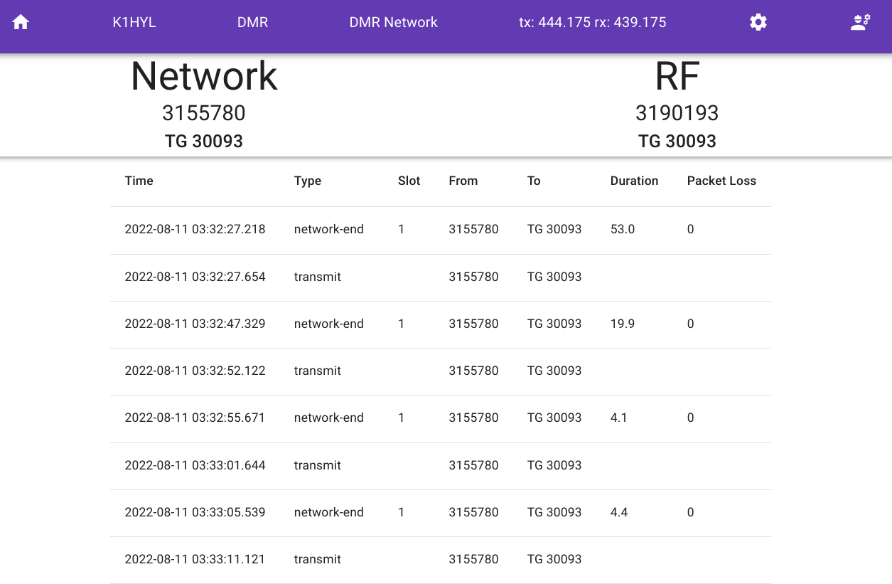
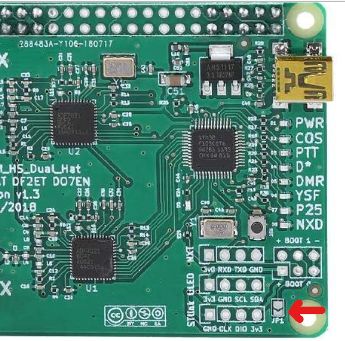

# Oli MMDVM

Oli-MMDVM seeks to be a simple front-end for using the MMDVMHost daemon. Currently, OliMMDVM 
only supports DMR, and has only been tested using the TGIF and Brandmeister networks.

Current functionality is limited to DMR networks, but others modes (DSTAR, YSF) will be added at a later time.



## Recommended Hardware

1. Currently only supports the Raspberry Pi 4 SBC.
2. [MMDVM Hotspot Dual Antenna Board Duplex](https://www.amazon.com/gp/product/B07XBZYHFC) (no affiliate link)
3. A case of your choosing

## Hardware Prerequisites

You will need to patch the firmware for the MMDVM board, provided you bought from the above link.
To do this, you need to follow the terrible instructions included in the package. [Toshen, KE0FHS has 
written a comprehensive guide on how to update the firmware](https://amateurradionotes.com/firmware.htm).

The key thing is to remember to short the JP1 board and keep it shorted until the update is done.



## Installation

Oli-MMDVM was designed to be run in a Docker container. Provided you're using the recommended hardware,
no other changes should be required. Complete the following steps:

1. Install your Raspberry Pi or similar SBC with the standard Raspberry Pi image.
2. Install Docker and docker-compose [Dev.To tutorial](https://dev.to/elalemanyo/how-to-install-docker-and-docker-compose-on-raspberry-pi-1mo) 
3. Run the following commands:
```bash
sudo usermod -aG dialout pi
sudo usermod -aG docker pi
sudo reboot
curl https://raw.githubusercontent.com/dannyquist/oli-mmdvm/main/docker-compose.yml -o docker-compose.yml
docker-compose up
```

## Development Install

Check out the code repository from Github:

```bash
git clone --recurse-submodules https://github.com/dannyquist/oli-mmdvm.git
cd oli-mmdvm
```

Create pre-requisite directories

```bash
sudo mkdir /oli
sudo chown -R pi /oli
cp conf/MMDVM.ini.handlebars /oli
```

Install yarn / nextjs dependencies (get a coffee):

```bash
yarn
```

Build the code (this will take a while):

```bash
yarn build
```

Install modified MMDVMHost:

```bash
cd MMDVMHost
make -j
INSTALL_DIR=/oli make install
```

Start the webserver:

```bash
yarn dev
```

Visit http://yourpi.local:3000/wizard on your browser, configure and 
press `Save`.

Start MMDVMHost

```bash
/oli/MMDVMHost /oli/conf/MMDVM.ini
```

Refresh the main page http://yourpi.local/ and you should see some activity.

# Contribution Guide

Send me a pull request.

# License
Copyright &copy; 2022 Danny Quist, K1HYL

See `LICENSE` file.

# Changelog

14 August 2022 - initial release for Defcon 30 Ham Radio Village talk
